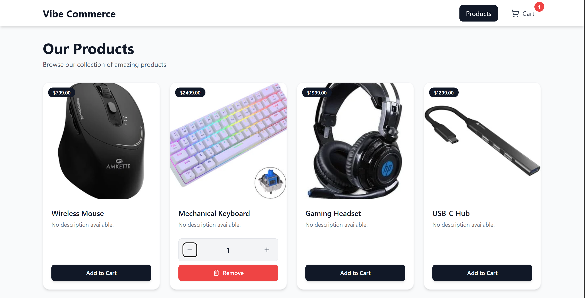
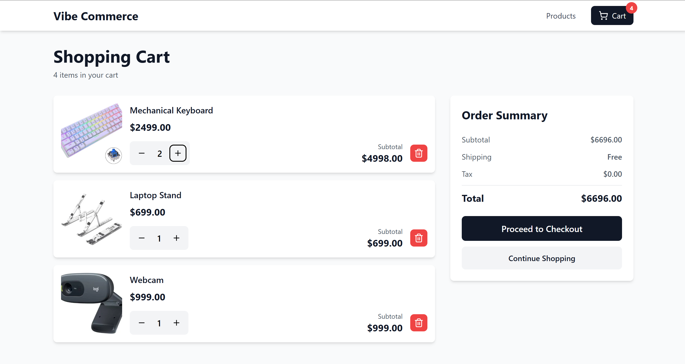
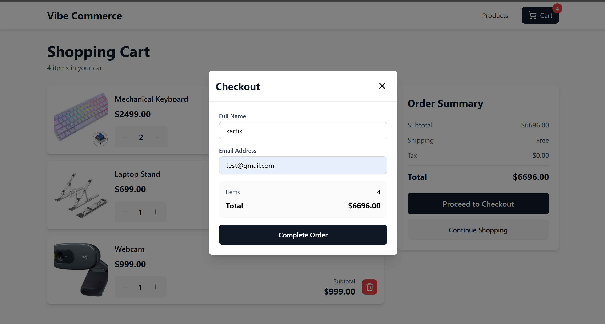

# Mock E-Com Cart — Full Stack Assignment

**Tech Stack:**  
React (frontend) · Node.js / Express (backend) · MongoDB (database)

---

## Overview

This project is a **basic full-stack shopping cart app** built as part of the **Vibe Commerce Internship Assignment**.  
It demonstrates a simple e-commerce workflow — product listing, cart management, and checkout — using RESTful APIs.

---

---
## loom demo video

Watch the full project walkthrough here: 
[Loom Demo Video](https://www.loom.com/share/8da03ddc4f20475fbf7c0a11cb0bdb5e)
---

##  Features

###  Frontend (React)
- Displays a product grid with **5–10 mock items**  
- Each product card shows **name, price, and Add to Cart button**  
- **Cart view**: shows added items, quantity controls (+, -), remove option, and total amount  
- **Checkout form**: collects name & email → shows a mock **receipt modal**  
- Fully **responsive design**

###  Backend (Node.js + Express)

| Endpoint | Method | Description |
|-----------|---------|-------------|
| `/api/products` | GET | Returns mock product list |
| `/api/cart` | GET | Returns cart items & total |
| `/api/cart` | POST | Adds `{ productId, qty }` to cart |
| `/api/cart/:id` | DELETE | Removes item by ID |
| `/api/checkout` | POST | Generates mock receipt with total & timestamp |

- MongoDB used for basic persistence (can run with mock data)
- Includes CORS, JSON parsing, and clean controller/route structure

---
##  Folder Structure
```bash
Vibe Commerce/
|-- frontend/
|   |-- src/
|   |   |-- components/
|   |   |-- context/
|   |   |-- lib
|   |   |-- pages/
|   |   |-- App.jsx
|   |   |-- index.css
|   |   `-- main.jsx
|   |-- package.json
|
|-- backend/
|   |-- node_modules
|   |-- src/
|   |   |-- controllers/
|   |   |-- routes/
|   |   |-- app.js
|   |   `-- server.js
|   |
|   |-- package-lock.json
|   `-- package.json
|
|-- screenshots/
|   |-- homepage.png
|   |-- cart.png
|   `-- checkout.png
|
|-- README.md

```


---
# Create a .env file:

PORT=8000
CLIENT_URL=http://localhost:5173
---

## Setup Instructions

### Clone Repository
```bash
git clone [https://github.com/karTik-kuMar04/Vibe-Commerce]
cd frontend
npm run dev
cd ..
cd backend
npm run dev
```


## 📸 Screenshots

### 🏠 Home Page


### 🛒 Cart Page


### 💳 Checkout

